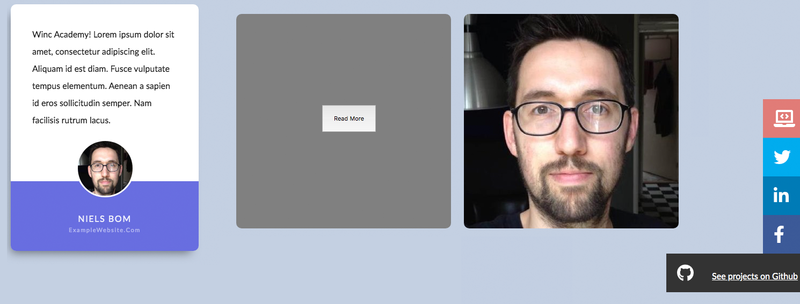
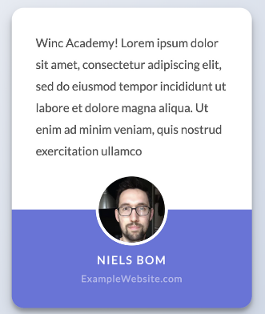
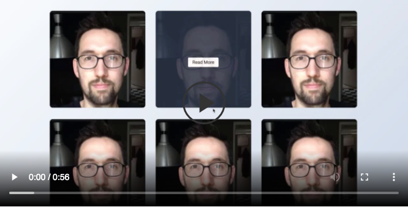

# **Project Next Level CSS**
Winc Academy Project - Week 4: Next Level CSS

Screenshot Mijn versies van Level 1 - Testimonial / Level 2 - Portfolio Grid / Level 3 - Social Media Buttons

Bekijk de live versie van de Testimonial: https://nextlevelcsslevel1.netlify.app/
Bekijk de live versie van het Portfolio Grid: https://nextlevelcsslevel2.netlify.app/
Bekijk de live versie van de Social Media Buttons: https://nextlevelcsslevel3.netlify.app/

Met dit project heb ik mijn CSS skills tot een nieuw level gebracht. 
De opdracht was om de bovenstaande voorbeeld designs zo goed mogelijk na te maken.

# **Informatie over de opdrachten**

**Level 1 - Testimonial**

Screenshot Voorbeeld Level 1 - Testimonial

We hebben de volgende kleuren gebruikt:

- footer testimonial **paars/blauw**:  #686de0
- Achtergrond pagina **grijs**: #c3cfe2
- Achtergrondkleur tekst **wit**: #fff

**Level 2 - Portfolio Grid**

Screenshot Voorbeeld Level 2 - Portfolio Grid

In dit level gaan we een portfolio grid maken. We zetten er nu een plaatje in, maar je kan er van alles inzetten. 
Je kunt de foto van Niels bijvoorbeeld vervangen door een testimonial kaartje die je in level 1 hebt gemaakt, 
een Pokemon, een nieuws artikel, noem maar op.

Kleuren:

Achtergrond pagina **grijs**: #c3cfe2

**Mobile responsive:** 

- Je grid is mobile responsive voor 3 schermen
    - Desktop: 3 kolommen
    - Tablet: 2 kolommen
    - Mobiel: 1 kolom

**On hover:**

Er komt een button tevoorschijn on hover. De foto verdwijnt, smoothly.

Je hebt hier geen JavaScript voor nodig. Denk aan de pseudo classes :hover.

**Level 3 - Social Media Buttons**

Screenshot Voorbeeld Level 3 - Social Media Buttons

Zelfgemaakte social media buttons zijn altijd leuk om te hebben. Deze zijn heel fancy, er komt zelfs een kleine animatie bij kijken. 

Tip: gebruik: `transition: transform .3s ease-in-out;`

**Design & interactie:**
Dat groene aan de rechterkant is een bureaublad, je ziet dat de knoppen tegen de rand van de browser aan staan.

