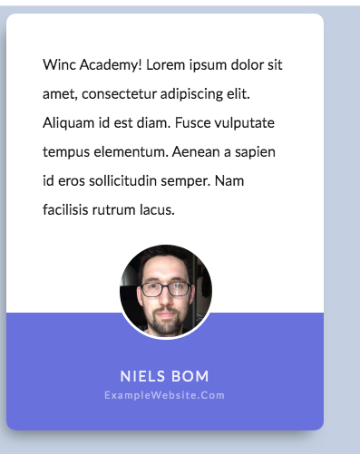

# **Project Next Level CSS**
Winc Academy Project - Week 4: Next Level CSS

Screenshot Voorbeeld Level 1 - Testimonial

Screenshot Mijn versie Level 1 - Testimonial

Bekijk de live versie van de Testimonial: 

Met dit project heb ik mijn CSS skills tot een nieuw level gebracht. 
De opdracht was om de bovenstaande voorbeeld designs zo goed mogelijk na te maken.

# **Informatie**

Level 1 - Testimonial:

We hebben de volgende kleuren gebruikt:

- footer testimonial **paars/blauw**:  #686de0
- Achtergrond pagina **grijs**: #c3cfe2
- Achtergrondkleur tekst **wit**: #fff
